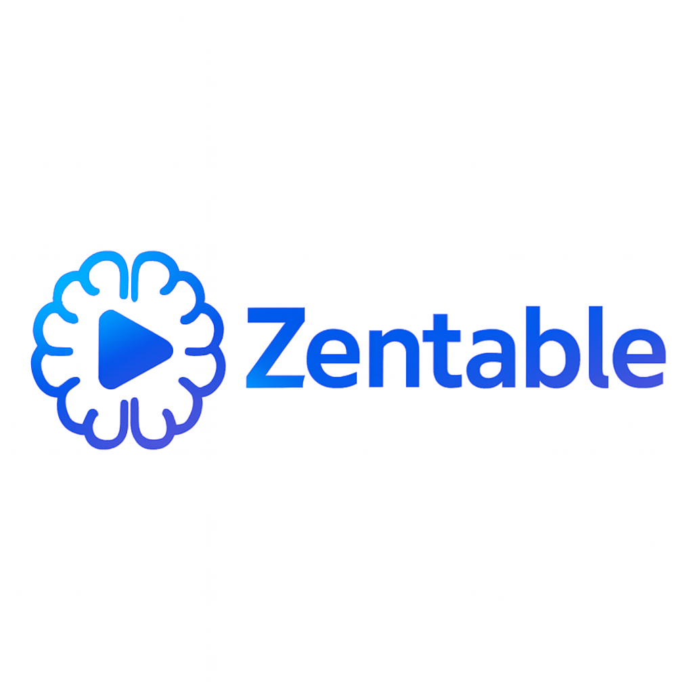

# Zentable AI - AI-Powered Presentation Generator

<div align="center">



**Transform ideas into professional presentations in minutes with AI**

[](https://www.gnu.org/licenses/agpl-3.0)
[](https://nextjs.org/)
[](https://www.typescriptlang.org/)
[](https://supabase.com/)
[](https://modelcontextprotocol.io/)

[🚀 **Live Demo**](https://zentableai.com) | [📚 **Documentation**](https://zentableai.com/docs-section) | [🔧 **MCP Integration**](https://zentableai.com/docs-section/features/mcp-integration)

</div>

## ✨ What is Zentable AI?

Zentable AI is an open-source, AI-powered presentation generator that creates professional slides from simple prompts. Built for developers, content creators, and businesses, it seamlessly integrates with your existing workflow through Model Context Protocol (MCP) support.

### 🎯 Key Value Proposition

- **🤖 AI-First**: Transform simple prompts into comprehensive presentations
- **🔌 Developer-Friendly**: Direct integration with Claude Code, Cursor, Windsurf, VS Code
- **🎨 Professional Quality**: 18+ slide templates, 27+ themes, AI-generated images
- **⚡ Lightning Fast**: Generate complete presentations in under 60 seconds
- **🌐 Open Source**: Self-hostable with full customization control

## 🚀 Features

### **🤖 AI Generation**
- **Multiple LLM Providers**: Groq/Llama 3.3, OpenAI, Azure OpenAI, Replicate
- **Smart Content Structuring**: Intelligent slide flow and hierarchy
- **Template Auto-Selection**: AI chooses optimal layouts for content
- **Multi-Language Support**: English, Spanish, French, German
- **Web Search Integration**: Real-time information retrieval

### **🎨 Design & Templates**  
- **18+ Slide Templates**: Title+Bullets+Image, Two Column, Accent designs, and more
- **27+ Visual Themes**: Gradients, solid colors, waves, glass effects
- **AI Image Generation**: Context-aware images via Replicate Flux
- **Rich Text Editor**: TipTap-based WYSIWYG with markdown support
- **Drag & Drop**: Intuitive slide reordering and organization

### **🔌 MCP Integration (Dual Architecture)**
- **Primary**: Use Zentable as MCP tool in AI development environments
- **Secondary**: Connect external MCP tools to enhance Zentable's capabilities
- **Supported Tools**: Claude Code, Cursor IDE, Windsurf, VS Code + Copilot

### **💼 Professional Features**
- **Presentation Mode**: Fullscreen presenting with presenter view
- **PDF Export**: High-quality export with theme preservation
- **Real-time Collaboration**: Supabase-powered multi-user editing
- **Cloud Sync**: Automatic saving and synchronization
- **Analytics Dashboard**: Usage tracking and performance metrics

## 🛠️ Technology Stack

- **Frontend**: Next.js 13.5.1, React 18, TypeScript
- **Styling**: Tailwind CSS, Radix UI/shadcn components
- **AI Integration**: Vercel AI SDK with multiple providers
- **Database**: Supabase (PostgreSQL + RLS + Auth)
- **Rich Text**: TipTap editor with extensions
- **Animation**: Framer Motion
- **Charts**: Recharts for analytics
- **File Processing**: jsPDF, html2canvas

## 🚀 Quick Start

### Prerequisites
- Node.js 16+ and npm
- Supabase account
- At least one AI provider API key (Groq recommended)

### Installation

```bash
# Clone the repository
git clone https://github.com/misbahsy/zentable.git
cd zentable

# Install dependencies
npm install

# Set up environment variables
cp .env.example .env.local

# Run development server
npm run dev
```

Visit [http://localhost:3000](http://localhost:3000) to see the application.

## ⚙️ Environment Setup

Create a `.env.local` file with the following variables:

```env
# Database & Authentication
SUPABASE_URL=your_supabase_project_url
SUPABASE_ANON_KEY=your_supabase_anon_key

# AI Providers (at least one required)
GROQ_API_KEY=your_groq_api_key                 # Recommended primary
OPENAI_API_KEY=your_openai_api_key             # Optional
REPLICATE_API_TOKEN=your_replicate_token       # For image generation

# Optional: Azure OpenAI
AZURE_OPENAI_API_KEY=your_azure_key
AZURE_OPENAI_ENDPOINT=your_azure_endpoint
AZURE_OPENAI_API_VERSION=2024-02-15-preview

# Application
NEXT_PUBLIC_APP_URL=http://localhost:3000
NODE_ENV=development
```

### AI Provider Setup
1. **Groq** (Recommended): Get free API key at [console.groq.com](https://console.groq.com)
2. **OpenAI**: API key from [platform.openai.com](https://platform.openai.com)
3. **Replicate**: Required for image generation at [replicate.com](https://replicate.com)

## 🏗️ Project Structure

```
zentable-ai/
├── app/                    # Next.js App Router
│   ├── api/               # API routes
│   │   ├── generate-*/    # AI generation endpoints
│   │   └── mcp/          # Model Context Protocol server
│   ├── docs-section/      # Documentation pages
│   ├── dashboard/         # User dashboard
│   └── auth/             # Authentication pages
├── components/
│   ├── slides/            # 18+ slide templates
│   ├── dashboard/         # Dashboard UI components  
│   ├── editor/           # Rich text editor components
│   ├── assistant-ui/     # AI chat interface
│   └── ui/               # Shared UI components
├── lib/
│   ├── ai/               # AI tools and generation logic
│   ├── supabase/         # Database utilities
│   └── themes.ts         # 27+ theme definitions
└── bin/                  # MCP server binary
```

## 🔌 MCP Integration Guide

Zentable supports MCP in two ways:

### 1. **Use Zentable in AI Development Tools** (Primary)

Connect Zentable to your favorite AI development environment:

#### **Claude Code Setup:**
```json
// .claude/mcp.json
{
  "mcpServers": {
    "zentable": {
      "command": "npx",
      "args": ["-y", "@menlopark/zentable-mcp@latest"],
      "env": {
        "ZENTABLE_API_KEY": "slai_your_api_key_here",
        "ZENTABLE_SERVER_URL": "https://zentableai.com"
      }
    }
  }
}
```

#### **Cursor IDE Setup:**
```json
// .cursor/mcp.json
{
  "mcpServers": {
    "zentable": {
      "command": "npx", 
      "args": ["-y", "@menlopark/zentable-mcp@latest"],
      "env": {
        "ZENTABLE_API_KEY": "slai_your_api_key_here",
        "ZENTABLE_SERVER_URL": "https://zentableai.com"
      }
    }
  }
}
```

#### **Available MCP Tools:**
- `create_presentation`: Generate complete presentations (3-20 slides)
- Supports multiple styles, languages, content lengths
- Built-in web search for current information

### 2. **Use External MCP Tools in Zentable** (Secondary)

Enhance Zentable by connecting external MCP tools via `Dashboard > Settings > Integrations`.

## 📚 Development Scripts

```bash
# Development
npm run dev        # Start development server
npm run build      # Build for production  
npm run start      # Start production server
npm run lint       # Run ESLint

# Testing
npm run test:mcp             # Test MCP integration
npm run test:standalone-mcp  # Test standalone MCP server

# MCP Server
npm run mcp:serve   # Start MCP server locally
```

### Manual Testing
Test pages available during development:
- `/test-title-bullets-image` - Template testing
- `/test-text-image` - Layout testing  
- `/test-image-text` - Component testing

## 🚀 Deployment

### Vercel Deployment (Recommended)

1. **Deploy to Vercel:**
   ```bash
   npx vercel
   ```

2. **Set Environment Variables:**
   - Add all required environment variables in Vercel dashboard
   - Update `NEXT_PUBLIC_APP_URL` to your Vercel domain

3. **Configure Supabase:**
   - Set up Row Level Security (RLS) policies
   - Configure authentication providers
   - Set up avatar storage bucket (optional)

### Database Setup

1. **Create a new Supabase project** at [supabase.com](https://supabase.com)

2. **Run the migrations** in your Supabase SQL editor:

```sql
-- Run the existing migration files:
-- 1. supabase/migrations/20240101000000_create_brainstorming_tables.sql
-- 2. supabase/migrations/20241220_add_api_keys.sql

-- OR use Supabase CLI:
supabase migration up

-- Note: Main tables (presentations, slides, profiles) may need manual creation
-- See lib/supabase.ts for complete schema definitions
```

3. **Core Tables Created**:
   - `presentations` - Main presentation data with AI generation settings
   - `slides` - Individual slides with content and templates  
   - `slide_images` - Multiple images per slide support
   - `profiles` - User profiles with subscription tiers and credits
   - `api_keys` - Hashed API keys for MCP access
   - `copilot_threads` & `copilot_messages` - AI assistant conversations
   - `brainstorming_sessions`, `ideas` - Brainstorming feature tables
   - `credit_transactions` - Usage tracking and billing

4. **Row Level Security (RLS)** is automatically enabled with proper policies

### Avatar Storage Setup (Optional)
1. Go to Supabase Dashboard > Storage
2. Create bucket named "avatars"  
3. Set bucket to public
4. Add RLS policies for authenticated users

## 🤝 Contributing

We welcome contributions! Please see our [Contributing Guidelines](CONTRIBUTING.md) for details.

### Development Setup
1. Fork the repository
2. Create a feature branch
3. Make your changes
4. Add tests if applicable
5. Submit a pull request

### Code Standards
- TypeScript with strict mode
- ESLint + Prettier for formatting
- Component patterns follow shadcn/ui conventions
- AI tools require clear descriptions and Zod schemas

## 📄 License

Zentable is dual-licensed:

- Open-source: GNU Affero General Public License v3.0 (AGPL-3.0). See [LICENSE](LICENSE).
- Commercial: Required for any business/commercial use, production deployments, offering the Software as a service, or any use that generates revenue. Contact: info@menloparklab.com

By default, developers and individuals may use/modify under AGPL-3.0. Businesses must obtain a commercial license.

## 🙏 Acknowledgments

### AI Providers
- [Groq](https://groq.com/) - Primary LLM provider
- [OpenAI](https://openai.com/) - GPT models
- [Replicate](https://replicate.com/) - Image generation
- [Azure OpenAI](https://azure.microsoft.com/en-us/products/cognitive-services/openai-service/) - Enterprise AI

### Infrastructure & UI
- [Supabase](https://supabase.com/) - Database and authentication
- [Vercel](https://vercel.com/) - Hosting and deployment
- [Radix UI](https://www.radix-ui.com/) - Accessible components
- [Tailwind CSS](https://tailwindcss.com/) - Utility-first CSS
- [Lucide React](https://lucide.dev/) - Beautiful icons

### MCP Ecosystem
- [Anthropic](https://www.anthropic.com/) - Model Context Protocol standard
- [Assistant UI](https://github.com/assistant-ui/assistant-ui) - React AI chat components

## 📞 Support & Community

- **🐛 Bug Reports**: [GitHub Issues](https://github.com/misbahsy/zentable/issues)
- **💡 Feature Requests**: [GitHub Discussions](https://github.com/misbahsy/zentable/discussions)  
- **📚 Documentation**: [zentableai.com/docs-section](https://zentableai.com/docs-section)
- **🔗 Website**: [zentableai.com](https://zentableai.com)

## 🗺️ Roadmap

- [ ] Real-time collaborative editing
- [ ] Advanced animation effects
- [ ] More AI provider integrations
- [ ] Mobile app development
- [ ] Enterprise SSO support
- [ ] API rate limiting improvements
- [ ] Advanced analytics dashboard

---

<div align="center">

**Built with ❤️ by the Zentable team**

[⭐ Star this repo](https://github.com/misbahsy/zentable) | [🐦 Follow us](https://twitter.com/misbahsy) | [🌐 Visit Website](https://zentableai.com)

</div>